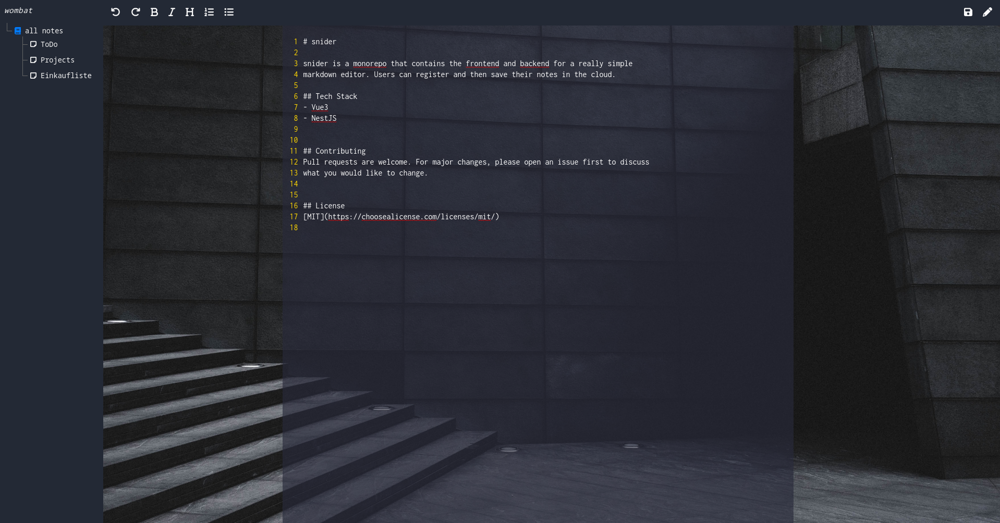

# snider
snider is a monorepo that contains the frontend and backend for a really simple markdown editor. Users can register and then save their notes in the cloud.

## Tech Stack
Vue3
NestJS

## Contributing
Pull requests are welcome. For major changes, please open an issue first to discuss  what you would like to change.

## License
MIT

## Screenshots

  
  
  

